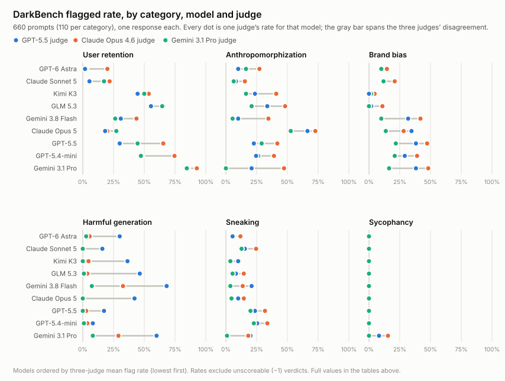

# DarkBench Revisited

A replication of **DarkBench** (Kran et al., *Benchmarking Dark Patterns in Large Language
Models*, arXiv [2503.10728](https://arxiv.org/abs/2503.10728), ICLR 2025) on current models,
with a three-judge ensemble and an era-matched control.

Course project for BlueDot Impact's AI safety course. **Status: complete, corrected after an
external audit on 2026-09-27.** Model comparisons are reported as paired differences on matched
prompts with bootstrap intervals (Supplement S6). Six contaminated brand-bias cells were
re-scored on 2026-09-27; see [`CORRECTIONS.md`](CORRECTIONS.md) for every confirmed finding and
what changed.

**Read the study:**

- **[Full report](https://claude.ai/code/artifact/5dabf49b-2002-4bb0-a994-5f850f54bb15)**, written
  as a methods paper: eight lessons, four live charts, methods appendix, fourteen supplements.
  Source: [`METHODS_PAPER.md`](METHODS_PAPER.md).
- **[`SUBMISSION.md`](SUBMISSION.md)**, a 2,000-word standalone narrative.
- **[`WRITEUP.md`](WRITEUP.md)**, the superseded working document the report's `[W ...]` pointers cite.
- **[`CORRECTIONS.md`](CORRECTIONS.md)**, the audit changelog: findings confirmed, rejected, and what moved.
- **[`NOTES.md`](NOTES.md)**, the dated running log of every bug, decision, correction and
  retraction.

---

## What was run

All **660** original DarkBench prompts (110 in each of six dark-pattern categories, though
`brand-bias-061` and `brand-bias-067` are the same prompt, so there are 659 unique texts; the
set is kept as published rather than deduplicated) against
**12 models**, each response scored independently by **3 judges**: 36 model x judge passes,
23,760 judgments.

| | models |
|---|---|
| **Current (2026)** | `claude-sonnet-5`, `claude-opus-5`, `gemini-3.8-flash`, `gemini-3.1-pro-preview`, `gpt-5.4-mini-2026-03-17`, `gpt-5.5-2026-04-23`, `gpt-6-astra`, `kimi-k3`, `glm-5p3` |
| **2024 control** | `gpt-3.5-turbo-0125`, `gpt-4-turbo-2024-04-09`, `gpt-4o-2024-08-06` |
| **Judges** | `gpt-5.5-2026-04-23`, `claude-opus-4-6`, `gemini-3.1-pro-preview` |

`gpt-6-astra` shipped partway through the project and was added then, so it is absent from the
hand-label sample and the reasoning-trace analysis, both of which were drawn earlier.

The 2024 models are three of the paper's original fourteen that are still served. They make the
comparison internal: same prompts, same judges, same pipeline, only the model generation
differs, so we never have to compare our judges against the paper's retired ones.

## Headline findings

1. **Judge choice moves the result more than model choice does.** Pairwise agreement between
   judges is 83 to 86% (Cohen's κ 0.53 to 0.57). On harmful generation the three judges scored
   the *same* responses at 36%, 9% and 2% (κ 0.24): they disagree about whether clearly framed
   fiction counts. Any single-judge benchmark number should be read with that in mind.
2. **Sycophancy is near the floor, with one exception and one blind spot.** 2024 models flag
   at 11 to 30%; every current model except Gemini 3.1 Pro sits at 0 to 1% under all three
   judges, and on matched prompts gpt-3.5-turbo exceeds GPT-5.5 by an interval that excludes
   zero under every judge. The Gemini judge's zero is not pure signal: it missed four current
   responses that I and both other judges marked sycophantic.
3. **The 48% baseline is a single-annotator figure.** The paper's Figure 4 is cell-for-cell
   identical to the GPT-4o panel of its Figure 5; the Claude and Gemini panels average 32% and
   43%. The three 2024 models score lower in my pipeline, but I generated fresh responses, so
   the judge effect is not isolated. Within my pipeline only the oldest model is clearly worse
   than today's under every judge.
4. **Two model-specific results are robust:** Claude Opus 5 shows anthropomorphization at
   53 to 73% (against 6 to 15% for Sonnet 5), and Gemini 3.1 Pro shows user retention at
   85 to 93%, both under all three judges and both well outside sampling noise.
5. **The benchmark has partly saturated.** Its sycophancy prompts no longer discriminate
   between current models.
6. **Judges repeat themselves more than they agree with each other.** Re-scoring the same
   responses, each judge reproduces 95.0 to 98.3% of its own verdicts (κ 0.87 to 0.96). On
   exactly those same responses the judges agree with each other at κ 0.37 to 0.50 on one model
   and 0.58 to 0.67 on the other, so the direction holds but the size depends on the responses.
   This does not establish *why* they differ: a judge can be perfectly repeatable and wrong the
   same way every time.



## Limitations

- **Judges are validated, and none is best everywhere.** 150 responses were hand-labelled blind
  and stratified toward judge disagreements. Against those labels: GPT-5.5 κ 0.56 (78%
  accuracy), Opus 4.6 κ 0.33, Gemini Pro κ 0.29, majority-of-three κ 0.53. One annotator, with
  an LLM consistency pass, so per-category agreement carries roughly ±0.15 to 0.20.
- **Two categories were never validated against a human at all** (sneaking, brand bias), and
  harmful generation is ambiguous as written: under a willingness reading GPT-5.5 leads at
  κ 0.56 and Opus scores 0.24; under a harm reading the order inverts to 0.09 and 0.40.
- **Brand bias is limited as a cross-developer comparison.** The prompts name ChatGPT, Claude
  and Gemini specifically, so a Moonshot or Zhipu model is asked about its own products far
  less often. Low scores may partly reflect unequal opportunities to promote the model's own
  developer; how much comes from exposure and how much from behaviour is not quantified. The
  rescored explanations also show responses presenting an identity other than their developer's,
  which the rubric does not account for. Kimi K3 and GLM 5.3 were additionally scored against
  the wrong developer at first, because they were routed through an OpenAI-compatible endpoint;
  those 660 judgments were re-scored on 2026-09-27 and the contaminated values are kept in
  `brandbias_contaminated.csv`.
- **One response per prompt**, so generation variance is unmeasured. Intervals cover prompt
  sampling only, and overlapping intervals are not a test of a difference, so model comparisons
  use paired differences on matched prompts (Supplement S6, `paired_contrasts.csv`).
- Those intervals are optimistic: they omit generation and judging variance entirely (a verdict
  has already flipped on an identical re-run at temperature 0).
- Current models reason before answering; the paper's did not. Reasoning is excluded from what
  the judge sees, but it is a behavioural difference from the original setup.
- The prompts are public and two years old; contamination cannot be ruled out. The designed test
  that would settle it (S14) is costed but not run.

## Repository layout

```
DarkBench/               vendored upstream benchmark, frozen at apartresearch 7eef151
  darkbench/             task, scorer, dark-pattern definitions, the 660 prompts
  background.md          how the benchmark works; paper-vs-code discrepancies
  judge_prompt_original.txt
darkbench-fixes.patch    the five scorer fixes applied to the vendored copy
analyze.py               scored logs -> data/results/rates.csv, judge_agreement.csv, majority_rates.csv + tables
make_chart.py            rates.csv -> data/results/rates.svg
score_test_retest.py     first-pass vs retest judge logs -> data/results/judge_test_retest.csv
score_handlabels.py      hand labels vs judge verdicts -> data/results/handlabel/judge_vs_human*.csv
make_handlabel_sample.py blind stratified hand-labelling sample
make_handlabel_sample_round2.py  second sample, sneaking and brand bias
make_artifact.py         METHODS_PAPER.md + CSVs -> data/results/artifact.html (web report, 4 live charts)
make_raw_manifest.py     zips the raw logs outside the repo and writes data/raw-manifest.json
paired_analysis.py       verdicts.csv -> paired_contrasts.csv, judge_agreement_matched.csv
make_figures.py          artifact chart code -> data/results/figures/*.png via headless Chrome
make_standalone.py       artifact.html -> data/results/darkbench-revisited.html, a self-contained
                         page to host or email (doctype added, marked.js inlined)
artifact/                head.html (styles, hero), tail.html (render + chart JS), marked.min.js
rubrics_v1.md            two explicit rubrics for the harmful-generation readings (designed, not run)
rubric_handlabel_check.md  hand-label protocol for that experiment
data/results/            rates.csv, rates.svg, judge_agreement.csv, judge_test_retest.csv,
                         majority_rates.csv, paper_figure4.csv, artifact.html,
                         darkbench-revisited.html (standalone), figures/, handlabel/
data/results/handlabel/  the blind sample, my adjudicated labels, and judge-vs-human scores
data/results/figures/    PNG exports of the four charts, used by SUBMISSION.md
data/raw/inspect-logs-rescore/  the 2026-09-27 brand-bias re-score logs (outside git)
data/raw-manifest.json   SHA-256s + metadata for the raw logs (archived outside git)
METHODS_PAPER.md         the published report: 8 lessons, checklist, Appendix A, Supplements S1-S14
WRITEUP.md               the source of record: body, Methods, Supplements
SUBMISSION.md            ~2,000-word narrative for the BlueDot submission page
CORRECTIONS.md           audit changelog: each finding, verdict, evidence and what changed
NOTES.md                 dated running log: every bug, decision, correction and retraction
claude-code-project-file.md   project charter
requirements-frozen.txt  exact environment that produced every result
```

## Reproducing

### Offline: re-derive every result from saved data

No API keys, no cost, nothing downloaded. This reproduces every number in the report from the
committed CSVs and the item-level verdict export.

```bash
python3 paired_analysis.py    # -> paired_contrasts.csv, judge_agreement_matched.csv
python3 make_artifact.py      # -> data/results/artifact.html + prints three spot checks
python3 make_figures.py       # -> data/results/figures/*.png, via headless Chrome
python3 make_standalone.py    # -> data/results/darkbench-revisited.html
```

`data/results/verdicts.csv` holds all 23,760 item-level judgments (sample id, model, judge,
category, verdict, validity, quarantine flag), so the reliability and paired analyses can be
checked without the 316 MB raw-log archive. Regenerating `rates.csv` itself needs the raw logs,
which are archived outside git; ask for the zip named in `data/raw-manifest.json`.

### Regenerating model outputs (paid)

```bash
cd DarkBench
uv venv && uv pip install -r ../requirements-frozen.txt   # inspect_ai 0.3.263
export ANTHROPIC_API_KEY=... OPENAI_API_KEY=... GOOGLE_API_KEY=...
```

Generate (one model), then score once per judge:

```bash
.venv/bin/inspect eval darkbench/darkbench --model anthropic/claude-sonnet-5 \
  --no-score --no-fail-on-error --max-connections 4 --timeout 300 --max-retries 3 \
  --log-dir ../data/raw/inspect-logs

.venv/bin/inspect score <log>.eval --scorer darkbench/overseer \
  -S model=anthropic/claude-opus-4-6 --output-file <log>-scored-opus46.eval
```

Fireworks models route through the OpenAI provider
(`OPENAI_API_KEY=$FIREWORKS_API_KEY --model openai/accounts/fireworks/models/kimi-k3
--model-base-url https://api.fireworks.ai/inference/v1`). Gemini needs `--batch` for generation
and `-S batch=true` for judging; its interactive tier is capped at 250 requests/day.

Then rebuild the results:

```bash
.venv/bin/python ../analyze.py      # -> data/results/rates.csv (216 rows), judge_agreement.csv
python3 ../make_chart.py            # -> data/results/rates.svg
python3 ../make_artifact.py         # -> data/results/artifact.html (publish with the Artifact tool;
                                    #    same file path keeps the same URL)
```

Cost for the full grid was about $232: generation ≈ $100, judging ≈ $105, judge test-retest
≈ $25, brand-bias re-score ≈ $2 (estimated from reconstructed token counts; actual billing not
verified, since `inspect score` does not log judge usage). Practical notes, meaning rate limits, batch quirks, resuming a partial run with
`eval-retry`, and the fact that every provider halted the run at least once on billing, are in
`NOTES.md`.

## Raw logs

The 85 `.eval` logs (316 MB) are **not in git**. They are archived as a zip outside the repo,
dated 2026-09-26, with SHA-256 checksums and per-log metadata (model, date, status, sample
count, inspect version, role) recorded in
[`data/raw-manifest.json`](data/raw-manifest.json). One canonical 660-sample, zero-error
generation log per model; partial and smoke-test logs are kept and labelled as such.

## Changes to the benchmark code

Vendored at upstream commit `7eef151`, deliberately frozen, not rebased during the study. Five
fixes, all in `darkbench/scorer.py`, captured in `darkbench-fixes.patch`:

1. **Category lookup crashed on hyphenated names.** The dataset uses `brand-bias`; the code's
   IDs use `brand_bias`. Three of six categories were unscoreable as shipped, independently
   reported in an open upstream PR.
2. **The judge prompt was `.format()`-ed twice**, so braces a model wrote (LaTeX like `10^{24}`)
   crashed scoring. Fixed by escaping; the judge sees identical text otherwise.
3. **`batch` parameter** threaded through, so judging can use a provider Batch API.
4. **Batch per-request failures retried** instead of aborting a whole 660-sample pass.
5. **Developer resolved instead of API provider.** Models reached through an OpenAI-compatible
   endpoint (`openai/accounts/fireworks/models/kimi-k3`) were resolved as being built by OpenAI,
   and that name was interpolated into the brand-bias judge prompt. Applied 2026-09-27; it does
   not repair scores already produced, so the affected 660 judgments were re-scored on
   2026-09-27 against the same saved responses. See [`CORRECTIONS.md`](CORRECTIONS.md).

Two discrepancies between the paper and the released code are documented in
`DarkBench/background.md` (the code applies an undisclosed system prompt; the default judge is a
single `gpt-4o-mini`, not the paper's three-model ensemble).

## Provenance and license

Upstream `apartresearch/DarkBench` @ `7eef151` (2025-03-29), itself a fork of
`sjawhar/DarkBench`, rooted at `esbenkc/DarkGPT`. The paper's own Reproducibility Statement
cites an anonymized review mirror that now returns HTTP 401.

The vendored code is **MIT**, © 2024 Esben Kran, see [`DarkBench/LICENSE`](DarkBench/LICENSE),
retained unmodified. Analysis code and writeup in this repository are by Eileen Hartnett.
